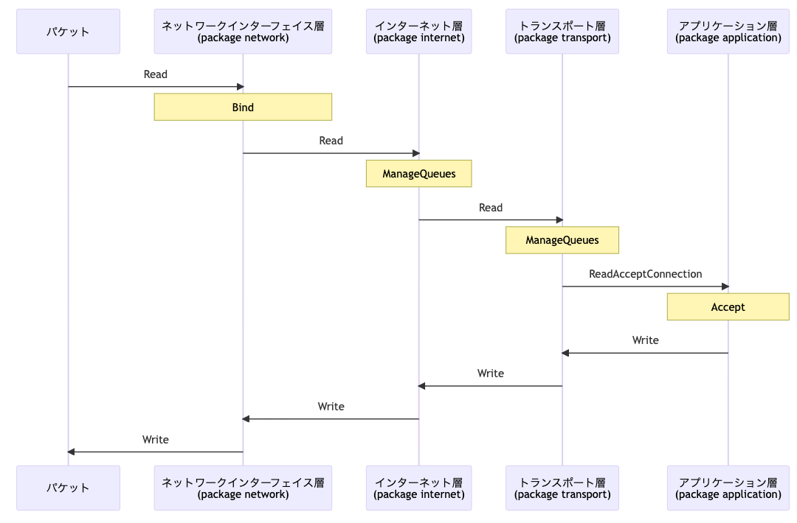
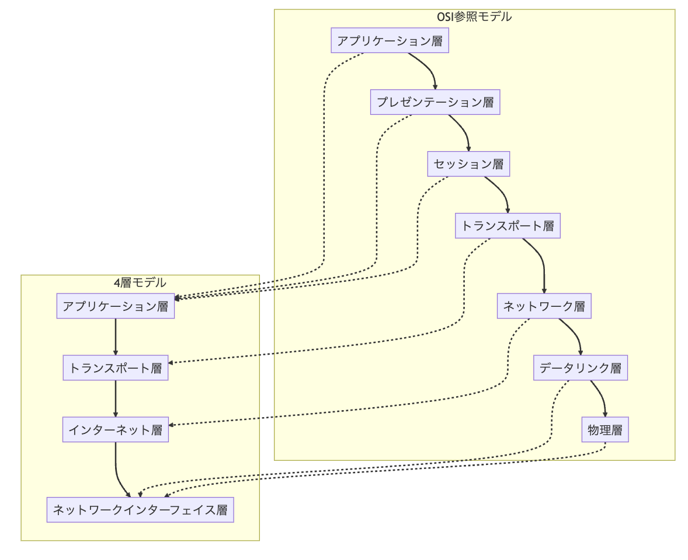

# tcp-ip-go

# 概要

net package を使わずに自作の TCP/IP プロトコルでサーバーを構築

# 環境構築

```
# make
xcode-select --install

# docker
https://docs.docker.com/engine/install

# WireShark
https://www.wireshark.org/download.html

make build

make up
```

# アプリケーションの全体像



# TCP/IP



# 各層の役割

-   ネットワークインターフェース層
    -   ネットワークデバイスの定義とパケットの送受信
-   インターネット層
    -   IP ヘッダの解析など
-   トランスポート層
    -   TCP ヘッダの解析、コネクションの確立・管理
-   アプリケーション層
    -   HTTP ヘッダの解析、HTTP リクエストの解析
